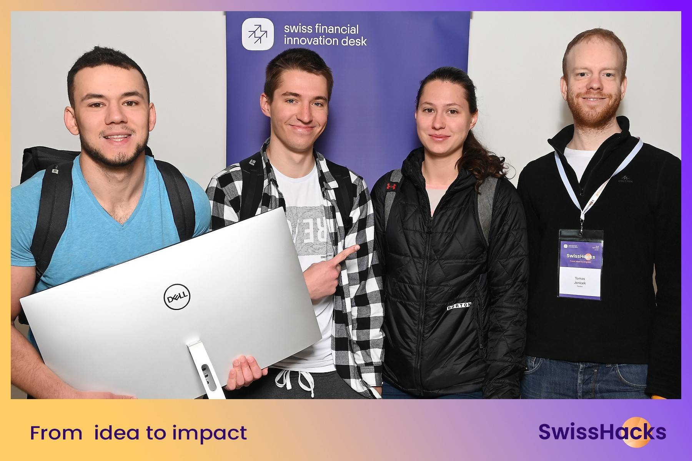

# Swiss AI Hackathon

I want to tackle this challenge: From Talk to Task: Insights from Client Conversations (UBS2) 🚀 How can we use Generative AI to analyze transcripts or notes of client conversations and automatically extract actionable insights, such as client requests and action items? 🔥 Learn more about the challenge Access the data Problem Client conversations contain key pieces of information, but manually analyzing transcripts or meeting notes to extract actionable insights is time-consuming and prone to error. For this challenge, we invite participants to develop a solution that leverages Gen AI to automatically analyze conversation transcripts and extract key pieces of information. The goal is to empower client advisors with concise, accurate, and actionable insights, helping them save time and better serve their clients. The solution should be capable of: Extracting specific information, such as client requests, and agreed-upon actions. Ensuring accuracy and relevance, even in the presence of noisy or incomplete data. Objective Information Extraction: Accurately identify and extract key elements, including action items or follow-ups. Accuracy and Relevance: Ensure that the extracted information is highly accurate and relevant to the context of the conversation. Robustness: Handle noisy or incomplete data gracefully, producing reliable outputs even in challenging conditions. Cost-Accuracy Comparison: Explore and compare different SLMs and LLMs, focusing on their performance and cost-efficiency. Support for Hackers You can expect in-person and online support from our data scientists and senior data scientists. Technical Preferences “UBS friendly” tech stack would be preferred (Azure, Python, Gitlab). Why hack? This challenge offers a unique opportunity to work on cutting-edge Generative AI technologies in a domain with real-world impact. By participating, you will: Contribute to shaping the future of client interaction in banking. Gain valuable experience in NLP, information extraction, and working with financial-domain challenges. Explore the trade-offs between performance and cost in AI model selection. Le'ts extend it to include all of the below: 1. Prep for meeting (fetching user data: previous meetings, contract details, potential services that are not still in use but could be suggested to the client etc.) 1. could connect with Outlook (?) 2. Assistance during online AND in-person meeting (online transcript & meeting facilitator - remind that something was not mentioned, recognizing next meeting setup and automatically adding it to your calendar, reminding meeting ends in N minutes etc…) - let’s brainstorm what other insights could be useful? 1. Maybe also automatic retrieving of information related to user question → RAG to retrieve UBS products? 2. Use whisper for online meeting transcripts and speaker identification 3. After meeting reporting 1. Create PDF with the report 2. Extract client requests (for this we will need to evaluate!!! how our method performs (will need to be in the slides) - there’s train/val/test dataset) - needs multilingual model 1. Use Apertus 2. Use models from Azure Foundry 3. Use on device models - security reasons 4. Should be able to switch between them on demand 3. In UI nicely visualize the TASKS (action items!) that the advisor has after the meeting - connecting the agent to also automatically execute them 1. Should be able to UPLOAD additional documents associated with the meeting - Q: what documents we expect? 4. Chatbot in UI to answer questions specific to this (and previous meeting) - Use APERTUS 🙂

Swiss AI Hacks 2025 took place on September 26-27, 2025, in Zurich.



## Monorepo structure

A monorepo containing:

- `frontend`: Next.js + React + TypeScript web application
- `backend`: Python FastAPI backend
- `scripts`: Python analytical scripts
- `docker`: Docker configuration files
- `terraform`: AWS infrastructure as code

[](https://github.com/user/swisshacks/actions/workflows/deploy.yml)

## Getting Started with Docker

The easiest way to run the entire application locally is with Docker Compose:

```bash
# Build and start all services in development mode
docker compose up -d

# View logs
docker compose logs -f

# Stop all services
docker compose down
```

Once running, you can access:
- Frontend: http://localhost:3000
- Backend API: http://localhost:8000/api/v1
- API Documentation: http://localhost:8000/api/v1/docs
- In production, both frontend and API are accessible via the same CloudFront URL
- PostgreSQL Database: localhost:5432 (username: postgres, password: postgres, database: swisshacks)

## Manual Setup

### Frontend

```bash
cd frontend

# Install dependencies
npm install

# Run development server
npm run dev
```

### Backend

```bash
cd backend

# Create and activate virtual environment
python -m venv venv
source venv/bin/activate  # On Windows: venv\Scripts\activate

# Install dependencies
pip install -r requirements.txt

# Run development server
uvicorn app.main:app --reload
```

### Scripts

```bash
. .env

cd scripts

# Create and activate virtual environment
python -m venv venv
source venv/bin/activate  # On Windows: venv\Scripts\activate

# Install dependencies
pip install -r requirements.txt

# Run a script
python analyze_data.py
```

## Deployment

This project is configured with GitHub Actions for CI/CD:

1. Pull requests to `main` branch trigger a Terraform plan
2. Merges to `main` branch trigger automated deployment to AWS:
   - Backend deployed to ECS Fargate
   - Frontend static files built and deployed to S3/CloudFront

### Required GitHub Secrets

For CI/CD to work properly, add these secrets to your GitHub repository:

- `AWS_ACCESS_KEY_ID` - AWS access key
- `AWS_SECRET_ACCESS_KEY` - AWS secret key
- `DB_USERNAME` - Database username
- `DB_PASSWORD` - Database password

## Infrastructure

The AWS infrastructure is provisioned using Terraform:

- VPC with public and private subnets
- ECS cluster running the containerized backend application
- RDS PostgreSQL database
- ECR for container images
- Load balancer for API traffic routing
- S3 bucket for hosting static frontend files
- CloudFront distribution for global delivery of frontend assets and API proxying
- IAM user with deployment permissions
- Optional GitHub Actions OIDC provider for keyless authentication

### Manual Terraform Deployment

```bash
cd terraform
cp terraform.tfvars.example terraform.tfvars
# Edit terraform.tfvars with your values

terraform init
terraform plan
terraform apply
```
